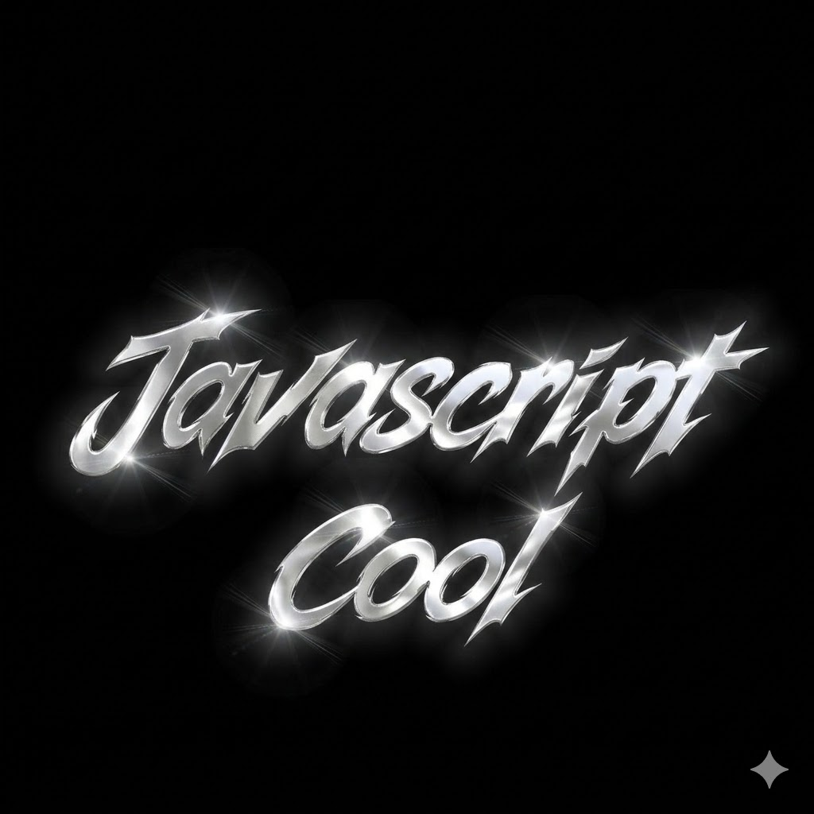

<p align="center">

</p>

<h1 align="center">Javascript Cool</h1>

<p align="center">
Advanced JavaScript Obfuscator for protecting source code (Open-Source).
</p>

<p align="center">


</p>


🔐 JScool — High/Extreme JavaScript Obfuscator Vesion 4.0

> Secure your code. Obfuscate with precision.

---

## 🌐 Select your language / Chọn ngôn ngữ

* 🇬🇧 [English](#-english)
* 🇻🇳 [Tiếng Việt](#-tiếng-việt)

---

# 🇬🇧 English

## Overview

**JScool** is a powerful CLI-based JavaScript obfuscator focused on **code protection**, not just visual complexity.

It applies multiple layers of transformation and runtime protection to make reverse engineering significantly harder.

---

## Features

* String encryption (RC4 + Base64)
* AST Transformation
* Identifier renaming (Unicode-based)
* Control flow flattening
* VM Protection
* Anti-Proxy / Network Detection
* Anti-Hook / Anti-Tamper / Anti -Debug
* Self-Defending / Integrity Check
* Optional junk/dead code injection
* ...

---

## Installation (optional)

```bash
npm install -g tsx
```

---

## Usage

```bash
tsx jscoolv2.mts
```

Then follow CLI prompts:

```text
Enter input JS file path: example.js
Add Anti-Hooking (native function integrity check)? [Y/N]:
Add Junk / Dead Code injection? [Y/N]:
Add Control Flow Flattening (switch / route obfuscation)? [Y/N]: 
```

---

## Output

```
example.obf.js
```

---

## Stars & Roadmap

Support the project by starring ⭐

```
150 |████████████████████████████████████████████████| 🎯
120 |██████████████████████████████████████          |
 90 |███████████████████████████                     |
 60 |██████████████████                              |
 30 |██████████                                      |
  0 |                                                |
```

### Goal

⭐ **150 Stars** → Release:

* JScool v2 (Enhanced Protection)
* Python Obfuscator version

---

## Disclaimer

This tool is intended for **legitimate code protection purposes only**.

---

# 🇻🇳 Tiếng Việt

## Giới thiệu

công cụ obfuscator javascript siêu mạnh 3636% bởi Trương Nhật Bảo Nam (ktn)
---

* String encryption (RC4 + Base64)
* AST Transformation
* Identifier renaming (Unicode-based)
* Control flow flattening
* VM Protection
* Anti-Proxy / Network Detection
* Anti-Hook / Anti-Tamper / Anti -Debug
* Self-Defending / Integrity Check
* Optional junk/dead code injection
* ...

---

## Cài đặt (không bắt buộc)

```bash
npm install -g tsx
```

---

## Cách dùng

```bash
tsx jscoolv2.mts
```

Sau đó nhập:

```text
Enter input JS file path: example.js
Add Anti-Hooking (native function integrity check)? [Y/N]:
Add Junk / Dead Code injection? [Y/N]:
Add Control Flow Flattening (switch / route obfuscation)? [Y/N]: 
```

---

## Output

```
example.obf.js
```

---

## Stars & Roadmap

Ủng hộ project bằng cách ⭐

```
150 |████████████████████████████████████████████████| 🎯
120 |██████████████████████████████████████          |
 90 |███████████████████████████                     |
 60 |██████████████████                              |
 30 |██████████                                      |
  0 |                                                |
```

### Mục tiêu

⭐ **150 Stars** → Ra mắt:

* JScool v3 (bảo mật nâng cao)
* Phiên bản Python Obfuscator >.<

---

## Lưu ý

Tool được tạo ra nhằm mục đích **bảo vệ mã nguồn hợp pháp**.

---

Code Before
```
function greetUser(name) {
  const message = "Hello, " + name + "!";
  console.log(message);
  return message;
}

greetUser("World");
```

Code After
```

  var __INFO__ = {
    'Obfuscator': 'KTN',
    'Obfuscator Owner': 'Trương Nhật Bảo Nam - ktn',
    'Contact': 'https://github.com/Swp-dev/Javascript-Cool/'
  };
  /** Generated: 2026-05-02T12:25:35.431Z | https://tanstack-start-app.kingktn.workers.dev/ */
  
;(async function _ィこ7fあ28홽(){

var _蔾45骥7ポポむ=[[0,"19a4a2898f1168a",("==Q+"+"KDRJ"+"iP09")],[0,"2c10fb89a457a425","==gl"],[1,"313343e8e333e99b","f5FV"],[0,"663fea7a275f6c576",("=Qmo"+"xHbk")],[1,"e9e16d8626",("==QWR0UFFhQGXMRQGtkXKkVV"+"a1lSV5FCWMwVE91WLg1HMolC")],[0,"80dd8a21cd550",("==gc"+"gmR+"+"TkZS")],[0,"9c2873f33fa2aa2",("=wVWme"+"qlx9aD")],[0,"d81b4efe336291ed9",("==g"+"oAl"+"wM")],[2,"56601614628cda",("UHUHX1V+Y0NSdQEVBiZBRl"+"JzAEZTWUZeYVA2DW93Cw0=")]],_켔f2d邈e={};
(function(arr,n){if(!n)return;var x=function(){return arr.push(arr.shift())};while(n-- >0)x()})(_蔾45骥7ポポむ,5);
function _擐fbf70쑺c(i){
  var _쐥aピ탑4=5;
  var _len=_蔾45骥7ポポむ.length;
  var _i=((((i|0)-_쐥aピ탑4)%_len)+_len)%_len;
  if(_켔f2d邈e[_i])return _켔f2d邈e[_i];
  var _hasAtob=(typeof atob==='function');
  var _hasBuf=(typeof Buffer!=='undefined'&&Buffer&&typeof Buffer.from==='function');
  var _a=_hasAtob?atob:(_hasBuf?function(x){return Buffer.from(x,'base64').toString('binary')}:function(x){return x});
  var _u=function(x){try{return decodeURIComponent(escape(x))}catch(e){return _hasBuf?Buffer.from(x,'binary').toString('utf8'):x}};
  var _r=function(x){return x.split('').reverse().join('')};
  var _x=function(d,k){var o='';for(var i=0;i<d.length;i++)o+=String.fromCharCode(d.charCodeAt(i)^k.charCodeAt(i%k.length));return o};
  var _q=function(k,d){var s=[],j=0,i,r='',x=0,y=0,t;for(i=0;i<256;i++)s[i]=i;for(i=0;i<256;i++){j=(j+s[i]+k.charCodeAt(i%k.length))&255;t=s[i];s[i]=s[j];s[j]=t}for(i=0;i<d.length;i++){x=(x+1)&255;y=(y+s[x])&255;t=s[x];s[x]=s[y];s[y]=t;r+=String.fromCharCode(d.charCodeAt(i)^s[(s[x]+s[y])&255])}return r};
  var _v=_蔾45骥7ポポむ[_i],_m=_v[0],_k=_v[1],_d=_v[2],_o='';
  if(_m===0)_o=_u(_q(_k,_x(_a(_r(_d)),_r(_k))));
  else if(_m===1)_o=_r(_u(_x(_a(_r(_d)),_k)));
  else if(_m===2)_o=_u(_a(_x(_a(_d),_k)));
  else _o=_r(_u(_q(_k,_a(_d))));
  return _켔f2d邈e[_i]=_o;
}


(function(){
  var _쵠3e竴5ゥ=[91,169,123,111,136,75,118,174,106,66,62,16,65,0,65,4,65,8,65,12,65,15,69,4,5,6,207,7,8,240,219,72];
  var _灐dc쑶=0,_ゕょd1=0,_觞샨3ぢ=0;
  var _ミ懨俍f킃=null,_擇톙カ7깖=null;
  var _北6홰ミ=typeof window!=='undefined'?window:typeof globalThis!=='undefined'?globalThis:typeof self!=='undefined'?self:null;
  var _ゔ品偢2=typeof console!=='undefined'?console:{log:function(){},warn:function(){},error:function(){}};

  var _뭬9胡ぺ=(function(){try{var _ua=(typeof navigator!=='undefined'&&navigator.userAgent)||'';return /Mobi|Android|iPhone|iPad|iPod|Touch|Tablet/i.test(_ua)||(typeof navigator!=='undefined'&&(navigator.maxTouchPoints|0)>1)}catch(e){return false}})();

  var _턭둭ィ敒ゅ=(function(){try{return Function.prototype.toString}catch(e){return null}})();
  var _敊f곢た=function(m){var lim=Math.min(m|0,100000);if(_뭬9胡ぺ)lim=Math.min(lim,8000);var x=0;for(var i=0;i<lim;i++)x=((x<<1)^(i+x))|0;return x};
  var _碐c숇8=function(fn){
    if(!fn)return;
    try{

      var s='';
      if(_턭둭ィ敒ゅ){s=_턭둭ィ敒ゅ.call(fn)}else{s=Function.prototype.toString.call(fn)}
      if(s.indexOf('[native code]')<0)throw 1;

      if(fn.toString&&fn.toString!==Function.prototype.toString&&typeof fn.toString==='function'){
        var s2=_턭둭ィ敒ゅ?_턭둭ィ敒ゅ.call(fn.toString):Function.prototype.toString.call(fn.toString);
        if(s2.indexOf('[native code]')<0)throw 2;
      }
    }catch(e){try{debugger}catch(e2){}}
  };
  var _も7f9タ=[
    typeof setTimeout!=='undefined'?setTimeout:null,
    typeof clearTimeout!=='undefined'?clearTimeout:null,
    typeof setInterval!=='undefined'?setInterval:null,
    typeof clearInterval!=='undefined'?clearInterval:null,
    typeof JSON!=='undefined'?JSON.stringify:null,
    typeof JSON!=='undefined'?JSON.parse:null,
    typeof Object!=='undefined'?Object.keys:null,
    typeof Object!=='undefined'?Object.assign:null,
    typeof Object!=='undefined'?Object.defineProperty:null,
    typeof Array!=='undefined'?Array.prototype.map:null,
    typeof Array!=='undefined'?Array.prototype.forEach:null,
    typeof Array!=='undefined'?Array.prototype.filter:null,
    typeof Function!=='undefined'?Function.prototype.toString:null,
    typeof Function!=='undefined'?Function.prototype.call:null,
    typeof Function!=='undefined'?Function.prototype.apply:null,
    typeof eval!=='undefined'?eval:null,
    typeof parseInt!=='undefined'?parseInt:null,
    typeof parseFloat!=='undefined'?parseFloat:null,
    typeof decodeURIComponent!=='undefined'?decodeURIComponent:null,
    typeof encodeURIComponent!=='undefined'?encodeURIComponent:null
  ];
  var _き8a7り7=function(){
    var _嫭87た=0;
    while(_嫭87た<_쵠3e竴5ゥ.length){
      var _op=_쵠3e竴5ゥ[_嫭87た++];

      if(_op===59){}
      else if(_op===123){if(_北6홰ミ===null||typeof window==='undefined')return;}
      else if(_op===63){if(typeof document==='undefined')return;}
      else if(_op===136){try{debugger}catch(e){}}
      else if(_op===111){try{_灐dc쑶=typeof performance!=='undefined'&&performance.now?performance.now():Date.now()}catch(e){}}
      else if(_op===75){
        try{
          var _d=(typeof performance!=='undefined'&&performance.now?performance.now():Date.now())-_灐dc쑶;
          if(_d>(_뭬9胡ぺ?500:120)){for(var _qi=0;_qi<3;_qi++){try{debugger}catch(e){}_敊f곢た(_뭬9胡ぺ?6000:60000+_qi*30000)}}
        }catch(e){}
      }
      else if(_op===118){_敊f곢た(32)}
      else if(_op===66){try{_敊f곢た(_뭬9胡ぺ?((Math.random()*256)|0):((Math.random()*2048)|0)+256)}catch(e){}}
      else if(_op===174){
        try{
          if(_北6홰ミ&&((_北6홰ミ.outerWidth-_北6홰ミ.innerWidth)>160||(_北6홰ミ.outerHeight-_北6홰ミ.innerHeight)>160)){
            for(var _ci=0;_ci<2;_ci++){try{debugger}catch(e){}_敊f곢た(_뭬9胡ぺ?5000:40000+_ci*15000)}
          }

          var _trap={};
          try{Object.defineProperty(_trap,'toString',{get:function(){try{debugger}catch(e){}_敊f곢た(_뭬9胡ぺ?2000:20000);return ''}})}catch(e){}
          if(_ゔ品偢2&&typeof _ゔ品偢2.log==='function'){try{_ゔ品偢2.log.call(_ゔ品偢2,_trap)}catch(e){}}
        }catch(e){}
      }
      else if(_op===106){

        try{
          var _err=new Error('x');
          var _stk=(_err&&_err.stack)?String(_err.stack):'';
          if(_stk){
            var _bad=/\b(devtools?|chrome-extension|debugger|inspector)\b/i;
            if(_bad.test(_stk)){try{debugger}catch(e){}_敊f곢た(_뭬9胡ぺ?3000:25000)}

            var _depth=(_stk.match(/\n/g)||[]).length;
            if(_depth>40){try{debugger}catch(e){}_敊f곢た(_뭬9胡ぺ?2000:15000)}
          }
        }catch(e){}
      }
      else if(_op===62){try{if(typeof setInterval!=='undefined')setInterval(_き8a7り7,_뭬9胡ぺ?4500:1500+(((-5018)+5035)%250))}catch(e){}}
      else if(_op===65){var _fi=_쵠3e竴5ゥ[_嫭87た++];if(_も7f9タ[_fi])_碐c숇8(_も7f9タ[_fi]);}
      else if(_op===16){for(var _hi=0;_hi<_も7f9タ.length;_hi++){if(_も7f9タ[_hi])_碐c숇8(_も7f9タ[_hi])}}
      else if(_op===69){
        var _u=_쵠3e竴5ゥ[_嫭87た++],_m=_쵠3e竴5ゥ[_嫭87た++],_c=_쵠3e竴5ゥ[_嫭87た++];
        try{
          if(_北6홰ミ&&typeof fetch!=='undefined'){
            var _t0=Date.now();
            fetch(_擐fbf70쑺c(_u),{mode:_擐fbf70쑺c(_m),cache:_擐fbf70쑺c(_c)}).then(function(){
              if(Date.now()-_t0>3000){try{debugger}catch(e){}}
            }).catch(function(){});
          }
        }catch(e){}
      }
      else if(_op===207){
        var _l=_쵠3e竴5ゥ[_嫭87た++],_h=_쵠3e竴5ゥ[_嫭87た++];
        try{
          if(typeof XMLHttpRequest!=='undefined'&&!XMLHttpRequest.prototype.__jscool_wrapped){

            XMLHttpRequest.prototype.__jscool_wrapped=true;
            var _xo=XMLHttpRequest.prototype.open,_xs=XMLHttpRequest.prototype.send;
            XMLHttpRequest.prototype.open=function(){this.__jscool_ts=Date.now();return _xo.apply(this,arguments)};
            XMLHttpRequest.prototype.send=function(){var _self=this;try{this.addEventListener(_擐fbf70쑺c(_l),function(){try{var _cert=_self.getResponseHeader&&_self.getResponseHeader(_擐fbf70쑺c(_h));if(_cert){try{debugger}catch(e){}}}catch(e){}})}catch(e){}return _xs.apply(this,arguments)};
          }
        }catch(e){}
      }
      else if(_op===240){

        try{
          if(typeof window!=='undefined'&&typeof document!=='undefined'){
            var _cs=document.currentScript;
            if(_cs&&!_cs.src&&typeof _cs.textContent==='string'){
              var _s=_cs.textContent,_h2=0;
              for(var _si=0;_si<_s.length;_si++)_h2=(Math.imul(31,_h2)+_s.charCodeAt(_si))|0;
              if(_ミ懨俍f킃)_ミ懨俍f킃.fullHash=_h2;
              _ゕょd1=_h2;
            }
          }
        }catch(e){}
      }
      else if(_op===219){

        try{
          if(typeof window!=='undefined'&&typeof document!=='undefined'){
            var _cs2=document.currentScript;
            if(_cs2&&!_cs2.src&&typeof _cs2.textContent==='string'&&_cs2.textContent.length>=64){
              if(_ゕょd1===0){try{debugger}catch(e){}_敊f곢た(_뭬9胡ぺ?4000:30000)}

              var _t2=_cs2.textContent,_h3=0x811c9dc5;
              for(var _ti=0;_ti<_t2.length;_ti++)_h3=(Math.imul(_h3^_t2.charCodeAt(_ti),16777619))|0;
              if(_h3===0||_h3===_ゕょd1){try{debugger}catch(e){}_敊f곢た(_뭬9胡ぺ?4000:30000)}
            }
          }
        }catch(e){}
      }
      else if(_op===91){
        try{
          var _F=Function.prototype,_O=Object,_J=typeof JSON!=='undefined'?JSON:null;
          _ミ懨俍f킃={
            w:_北6홰ミ,
            st:_北6홰ミ&&_北6홰ミ.setTimeout,ct:_北6홰ミ&&_北6홰ミ.clearTimeout,
            si:_北6홰ミ&&_北6홰ミ.setInterval,ci:_北6홰ミ&&_北6홰ミ.clearInterval,
            fe:_北6홰ミ&&_北6홰ミ.fetch,xh:_北6홰ミ&&_北6홰ミ.XMLHttpRequest,
            fp:_F.toString,fc:_F.call,fa:_F.apply,
            ok:_O.keys,od:_O.defineProperty,
            js:_J&&_J.stringify,jp:_J&&_J.parse,
            fullHash:0
          };
        }catch(e){_ミ懨俍f킃={fullHash:0}}
      }
      else if(_op===169){
        try{
          var _check=function(fn){try{var _ts=_턭둭ィ敒ゅ?_턭둭ィ敒ゅ.call(fn):Function.prototype.toString.call(fn);return _ts.indexOf('[native code]')>=0}catch(e){return false}};
          var _wrap=function(fn,ctx){return function(){if(_check(fn))return fn.apply(ctx||this,arguments);return fn.apply(ctx||this,arguments)}};
          _擇톙カ7깖={
            log:_ゔ品偢2&&_ゔ品偢2.log?_wrap(_ゔ品偢2.log,_ゔ品偢2):function(){},
            warn:_ゔ品偢2&&_ゔ品偢2.warn?_wrap(_ゔ品偢2.warn,_ゔ品偢2):function(){},
            error:_ゔ品偢2&&_ゔ品偢2.error?_wrap(_ゔ品偢2.error,_ゔ品偢2):function(){},
            fetch:_北6홰ミ&&_北6홰ミ.fetch?_wrap(_北6홰ミ.fetch,_北6홰ミ):null,
            xr:_北6홰ミ&&_北6홰ミ.XMLHttpRequest||null,
            win:_北6홰ミ||null,
            doc:typeof document!=='undefined'?document:null
          };
        }catch(e){_擇톙カ7깖={}}
      }
      else if(_op===41){var _di=_쵠3e竴5ゥ[_嫭87た++];try{_ゕょd1=_擐fbf70쑺c(_di)}catch(e){_ゕょd1=null}}
      else if(_op===68){var _cv=_쵠3e竴5ゥ[_嫭87た++];_觞샨3ぢ=(_ゕょd1===_cv)?1:0;}
      else if(_op===241){var _off=_쵠3e竴5ゥ[_嫭87た++];_嫭87た+=_off|0;}
      else if(_op===64){var _off2=_쵠3e竴5ゥ[_嫭87た++];if(_觞샨3ぢ)_嫭87た+=_off2|0;}
      else if(_op===98){
        var _gi=_쵠3e竴5ゥ[_嫭87た++];
        try{
          if(_北6홰ミ){var _gk=_擐fbf70쑺c(_gi);_北6홰ミ[_gk]=_ゕょd1;}
        }catch(e){}
      }
      else if(_op===72){break}

      if(_蔾45骥7ポポむ&&_蔾45骥7ポポむ.length>0&&(_嫭87た&7)===0){try{_擐fbf70쑺c((_嫭87た*2654435761)>>>0)}catch(e){}}
    }
  };
  try{_き8a7り7()}catch(e){}
})();


(function(){
  var _あc4b5=(504618759^939270023);
  if(typeof _あc4b5!=='number'||(_あc4b5|0)!==(703578240|0)){
    try{debugger}catch(e){}
    var _萳1宜bヴ=function(){var _ヨ68ォ=0;while((typeof undefined==='undefined')){_ヨ68ォ=(_ヨ68ォ+1)|0;try{debugger}catch(e){}}};
    try{_萳1宜bヴ()}catch(e){}
    return;
  }
  if(typeof window==='undefined'||typeof document==='undefined')return;
  try{
    var _cs=document.currentScript;

    if(!_cs)return;
    if(_cs.src)return;
    if(typeof _cs.textContent!=='string')return;
    var _s=_cs.textContent||'';
    if(_s.length<64)return;
    var _h=0;
    for(var _i=0;_i<Math.min(_s.length,512);_i++)_h=(Math.imul(31,_h)+_s.charCodeAt(_i))|0;
    if(_h===0){try{debugger}catch(e){}}
  }catch(e){}
})();

if(((7151)&-65)<((76990)+4858)){var _ばセうづ=null;}
if(((6666*(6666+1))%2!==0)){var _篁0촤ウ=((16365)&-6786);throw new Error('68e250'+_篁0촤ウ)}
var _醠駳렝b=((Math.random()*(27+0))|0)+((3191)-3171);void _醠駳렝b;
var _ヌぎら즟합=(function(){function _ヌぎら즟합(){this._へゐ쟜f=((13882)-7614)}_ヌぎら즟합.prototype._篣c48=function(){return this._へゐ쟜f^((46)^8897)};return _ヌぎら즟합})();
if(((11058|0)!==(11058|0))){var _ユ0韺ゔ=((9211)&-8257);throw new Error('6ba911'+_ユ0韺ゔ)}
try{(typeof Promise!=='undefined')&&Promise.resolve(((5164)+2285)).then(function(_v){return _v})}catch(e){}
void(((232273546)^8719)^((997375935)&-12323));
if(((3448|0)!==(3448|0))){var _媈ソ52={a:((10459)&-10395),b:((4599)&-4567)};var _컓4るe=_媈ソ52.a+_媈ソ52.b;}
var _ゕギヒ둵9=(function(){var _v=((6979)&-1);return{_퓟5f5:function(x){_v=(_v^x)|0},_蚔潓d1:function(){return _v}}})();
var _瑢8鯸7ク=(function(){var _v=(3150+0);return{_皼ィb5:function(x){_v=(_v^x)|0},_焼a7ゆ:function(){return _v}}})();
var _瓀ラヱ4=(Date.now()&((5188)^5248))|((701)-657);if(_瓀ラヱ4===-1){throw new Error('_'+_瓀ラヱ4)}
var _ツボモ2=(Date.now()&((1496)-1388))|((76)^245);if(_ツボモ2===-1){throw new Error('_'+_ツボモ2)}
var _롓ゆ3め=((Math.random()*(28+0))|0)+(7+0);void _롓ゆ3め;
[(200+0),((1976)&-1953),((15475)-15444),((10483)&-10337)].reverse();
var _렇b컎7=(Date.now()&(23+0))|(188+0);if(_렇b컎7===-1){throw new Error('_'+_렇b컎7)}
var _く793=((Math.random()*((4725)^4666))|0)+((9031)^9032);void _く793;
var _ゔ3쒀ぬメ=(function(){var _v=((21384)-12759);return{_ヺ珃6ふ:function(x){_v=(_v^x)|0},_狇マ빊c:function(){return _v}}})();
var _カcf3=Math.floor(Math.random()*((65955)+5472));
(function(){try{throw new Error('d0c98beb')}catch(e){}})();
void(/9555/.test('c7b00510'));
var _ヴ水3ぁ=(function(){return Array((8+0)).join('d49a')})();
function _ァ竖ルb1쪾5(name){const _욭06f虯a9=_擐fbf70쑺c(-7200+7200)+name+_擐fbf70쑺c(1+0);console[_擐fbf70쑺c(2+0)](_욭06f虯a9);return _욭06f虯a9}if((10150|0)!==(10150|0)){var _か邷6お={a:12142^12129,b:457^389};var _쬮ぢ讫즩=_か邷6お.a+_か邷6お.b}try{Object.freeze({a:7+0})}catch(e){}var _쳧9づf=Date.now()&(16360^16278)|12052-11871;if(_쳧9づf===-1){throw new Error("_"+_쳧9づf)}void /740c/.test("f1afe971");if(403+0<104150-14940){var _닼0d7=null}if((14661|0)!==(14661|0)){var _셩385=8153+0;throw new Error("ad9688"+_셩385)}[-11535+11556,12350&-12307,11255^11013,774-529].reverse();_ァ竖ルb1쪾5(_擐fbf70쑺c(10967&-10965));(function(){try{throw new Error("001f8cda")}catch(e){}})();(function(){try{throw new Error("9bb8bb04")}catch(e){}})();(function(){try{throw new Error("91572ba8")}catch(e){}})();try{Object.freeze({a:9763^9734})}catch(e){}var _ば8ゼ8=function(){return Array(17+0).join("a8bf")}();if((3806^11127)<(28159&-13)){var _짙뚀0f=null}if(5907*(5907+1)%2!==0){var _퍻び퉡ホ={a:-9020+9061,b:-14983+15025};var _ぅ6a첂=_퍻び퉡ホ.a+_퍻び퉡ホ.b}if(14820-8303<(48763&-4097)){var _ばa8촍=null}[9143-9062,15327&-15117,9578^9529,-5163+5278,13099^13227].reverse();[15734^15719,-8391+8526,157+0,10045&-10026,56+0,10849-10699,-10165+10335,14827&-14626].reverse();var _で륒9ヂ=Math.floor(Math.random()*(16367&-9223));var _졂b3f=(Math.random()*(9625^9682)|0)+(13840^13873);void _졂b3f;try{Object.freeze({a:229+0})}catch(e){}void(122480328-8451^(518154089^15700));try{Object.freeze({a:5097&-4649})}catch(e){}var _퇈ャ6ギ4=function(){function _퇈ャ6ギ4(){this._ヸゅノ7=6120+0}_퇈ャ6ギ4.prototype._怤じ9ポ=function(){return this._ヸゅノ7^16383&-8761};return _퇈ャ6ギ4}();(function(){try{throw new Error("fa43e6dd")}catch(e){}})();try{Object.freeze({a:575+0})}catch(e){}if(18842-10858<39631+13323){var _ゑさa3=null}var _ど鸼ヅ8=Math.floor(Math.random()*(96069^12564));void(393162256-439^(358775607^14788));(function(){try{throw new Error("99ff5a28")}catch(e){}})();if((14670|0)!==(14670|0)){var _ゕゥdェ={a:61+0,b:2252^2260};var _봝a蘝8=_ゕゥdェ.a+_ゕゥdェ.b}
})();
```
**JScool — Keep your code safe.**

